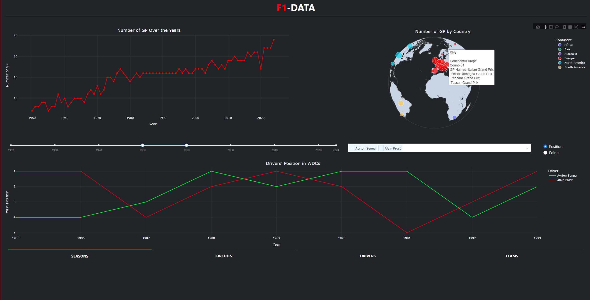

# 📊 F1-DATA - Quick intro
Dashboard to Analyze data about Formula 1  
**💻 DEPLOY [https://f1-data.onrender.com/](https://f1-data.onrender.com/)**  

### What you can do
📊 Navigate through **STATISTICS** (Seasons, Circuits, Drivers, Teams) - from 1950 to today

### How
🧑‍💻 Python  
📄 [f1db](https://github.com/f1db/f1db) 

### USAGE
 `pip install pandas plotly dash dash_bootstrap_components`
### `python app.py`
Runs the script locally.  
Open [http://127.0.0.1:8050/](http://127.0.0.1:8050/) to view it in the browser

#### SEASONS

#### CIRCUITS

#### DRIVERS

#### TEAMS

